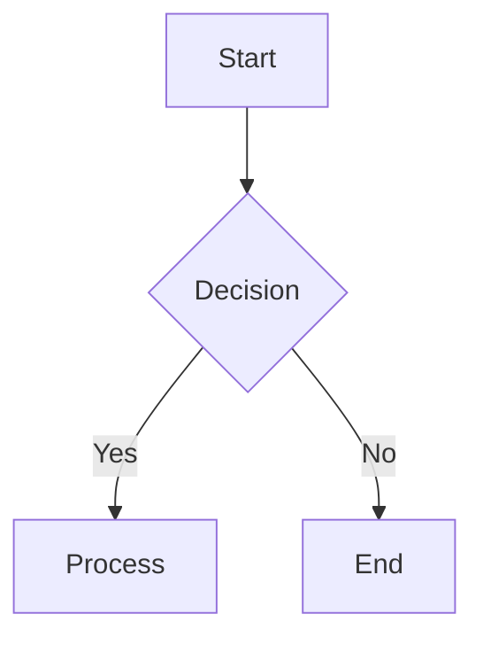

# Marp SmartArts

A collection of custom diagram plugins for Marp presentations, including Pyramid, Chevron, and Venn diagrams. These plugins integrate seamlessly with Marp and can coexist with standard Mermaid diagrams to create beautiful, interactive diagrams in your presentations.

## Project Structure

The project is organized into modular components:

- **Diagram Renderers**:
  - `pyramid.js`: Renders pyramid diagrams
  - `chevron.js`: Renders chevron diagrams
  - `venn.js`: Renders venn diagrams
  
- **Utilities**:
  - `utils.js`: Shared utility functions for all diagram types
  
- **Integration**:
  - `smartart-markdown-it.js`: Unified plugin that combines all diagram types
  - `smartart-map-engine.js`: Custom Marp engine that uses the unified plugin

## Usage with Marp CLI

```bash
npx @marp-team/marp-cli --engine ./smartart-map-engine.js your-presentation.md --output your-presentation.html
```

## Diagram Types

### Pyramid Diagrams

Create hierarchical structures with pyramid diagrams:

````markdown
```mermaid
pyramid
options: width=400 height=200 fontSize=18
    Strategy | #4285F4
    Tactics | #34A853
    Operations | #FBBC05
```
````

### Chevron Diagrams

Create process flows and sequential steps with chevron diagrams:

````markdown
```mermaid
chevron
options: width=200 height=100 fontSize=16
    Analysis | #1E88E5
    Design | #43A047
    Implementation | #FDD835
    Evaluation | #E53935
```
````

### Venn Diagrams

Create relationship and intersection diagrams with Venn diagrams:

````markdown
```mermaid
venn
options: width=600 height=400 fontSize=16
    Concept A | #4285F4
    Concept B | #34A853
    Concept C | #FBBC05
    Intersection | #EA4335
```
````

## Syntax Reference

All diagram types follow a similar syntax pattern:

```
diagram-type
options: width=X height=Y fontSize=Z
    Content 1 | #ColorCode
    Content 2 | fontSize=16 | #ColorCode
    ...
```

### Options

You can specify global options for each diagram:

- **width**: Width of the diagram in pixels
- **height**: Height of the diagram in pixels
- **fontSize**: Base font size for text in the diagram

### Content Format

Each line of content follows this pattern:

```
Text content | [options] | #color-code
```

- **Text content**: Plain text to display
- **Options**: Item-specific options like `fontSize=16` (optional)
- **Color code**: Hex color code starting with # (optional)

### Color Handling

There's an important difference in how colors are applied:

- **Pyramid and Chevron diagrams**: Colors are applied as background colors
- **Venn diagrams**: Colors are applied as text colors

## Integration with Standard Mermaid

These plugins work alongside standard Mermaid diagrams, so you can use both in the same presentation:

````markdown

````

## Multiple Diagrams on One Slide

You can combine multiple diagrams on a single slide:

````markdown
```mermaid
pyramid
options: width=300 height=200
Strategy | #4285F4
Tactics | #34A853
```

```mermaid
chevron
options: width=400 height=80
Plan | #1E88E5
Build | #43A047
Test | #FDD835
Deploy | #E53935
```
````

## Browser Compatibility

These plugins work in all modern browsers that support SVG and foreignObject elements.

## License

MIT
