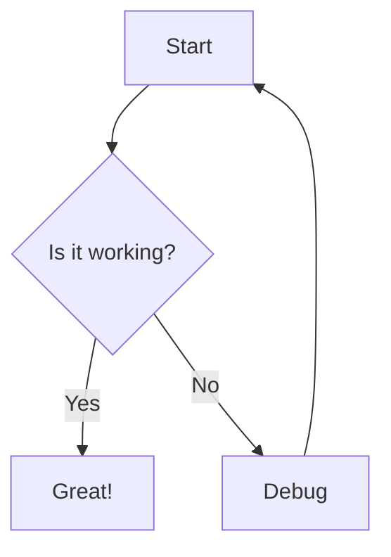
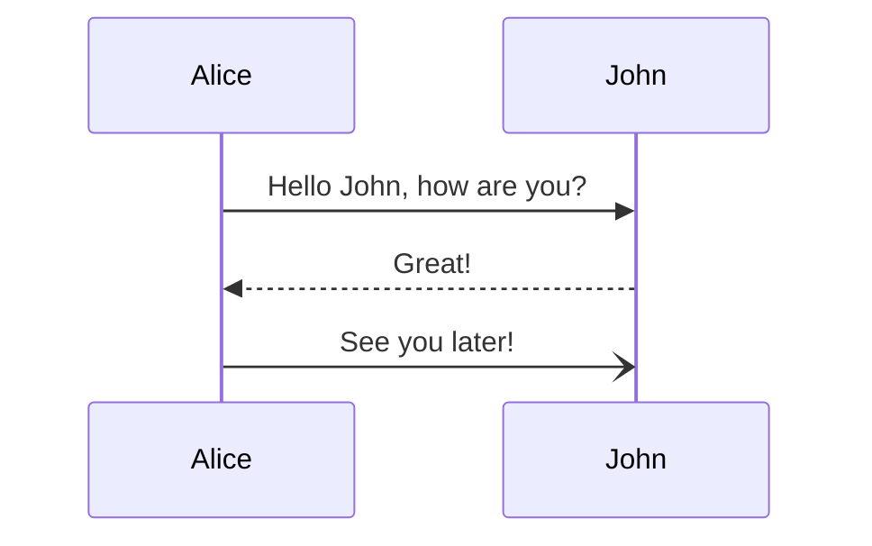
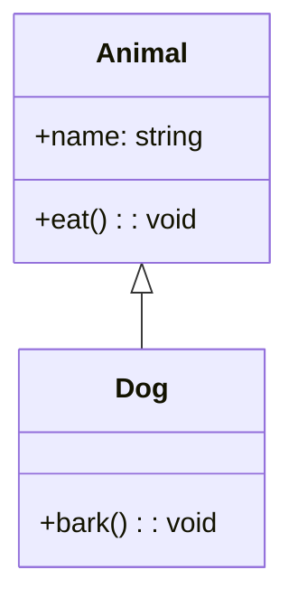
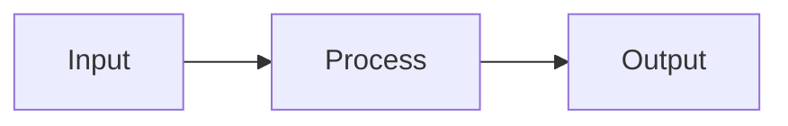
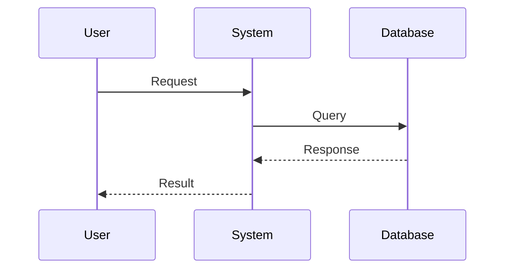

# Smart Diagram Integration Test

Testing various diagram types with Marp integration

---

## Standard Mermaid Flowchart



---

## Chevron Diagram - Basic

```mermaid
chevron
Planning
Development
Testing
Deployment
```

---

## Chevron Diagram - With Options

```mermaid
chevron
options: width=250 height=120 fontSize=16
    Analysis | #1E88E5
    Design | #43A047
    Implementation | #FDD835
    Evaluation | #E53935
```

---

## Standard Mermaid Sequence Diagram



---

## Standard Mermaid Class Diagram



---

## Pyramid Diagram - Basic

```mermaid
pyramid
    Strategic
    Tactical
    Operational
```

---

## Pyramid Diagram - With Options

```mermaid
pyramid
options: width=500 height=300 fontSize=16
    Vision | #4285F4
    Mission | #34A853
    Goals | #FBBC05
    Objectives | #EA4335
    Tasks | #5F6368
```

---

## Pyramid Diagram - With Custom Layer Options

```mermaid
pyramid
options: width=600 height=400
    Leadership | #1E88E5
    Management | fontSize=18 | #43A047
    Team Leads | #FDD835
    Developers | fontSize=14 | #E53935
    Support | #757575
```

---

## Venn Diagram - Basic

```mermaid
venn
A∩B
B∩C
A∩C
A∩B∩C
```

---

## Venn Diagram - With Options

```mermaid
venn
options: width=700 height=500 fontSize=20
Marketing
Sales
Product
Core Business | fontSize=24
```

---

## Venn Diagram - Business Context

```mermaid
venn
options: width=650 height=450 fontSize=18
    Technology | #1976D2
    Business | #388E3C
    User Experience | #F57C00
    Product Success | fontSize=22 | #D32F2F
```

---

## Multiple Diagrams on One Slide

### Pyramid and Mermaid Flowchart

```mermaid
pyramid
options: width=400 height=200
Strategy | #4285F4
Tactics | #34A853
Operations | #FBBC05
```



---

## Multiple Diagrams on One Slide

### Pyramid and Chevron Comparison

```mermaid
pyramid
    options: width=400 height=200
    Strategy | #4285F4
    Tactics | #34A853
    Operations | #FBBC05
```

```mermaid
chevron
    options: width=180 height=200
    Plan | #4285F4
    Do | #34A853
    Check | #FBBC05
    Act | #EA4335
```

---

## Multiple Diagrams on One Slide

### Venn and Sequence Diagram

```mermaid
venn
options: width=400 height=300
Design
Development
Testing
Quality
```



---

# Thank You!

All diagram types are working together in a single presentation.
